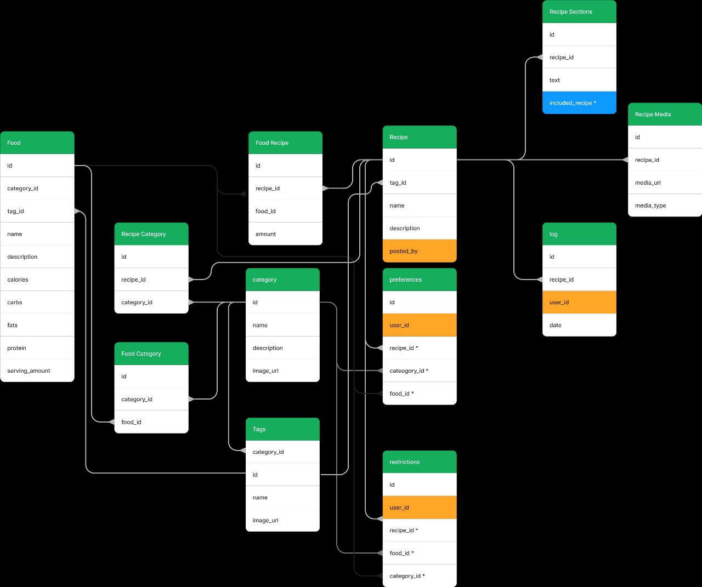

# Nutrition

The Nutrition server is dedicated to managing recipes, meals, food preferences, and restrictions within the application. It serves as an API, facilitating various functionalities, which are outlined below in this README.

## Technologies Used

This server is built using:

- **Java** - Spring Boot framework for creating robust and scalable RESTful APIs.
- **MongoDB** - A NoSQL database for flexible and efficient data storage.

## Database Schema

While the data is stored in MongoDB, here's an overview of the conceptual schema:

## Endpoints Schema

Here are the main endpoints to the system, for more information chechk the swap

### Food

- **Food** `/food`
  - Create, Read, Update, Delete food
  - `/search?` search for food
- **Filter by Category:** `/food/{category}`
  - Create, Read, Update, Delete categories
  - `/search?` search for foods with this category
- **Filter by Category and Tag:** `/foods/{category}/{tag}`
  - Create, Read, Update, Delete tags
  - `/search?` search for foods with this tag

### Recipes
- **Recipes:** `/recipes`
  - Create, Read, Update, Delete recipes
  - `/search?` search for recipes
  - `/suggestions` get recipe suggestions for that user
